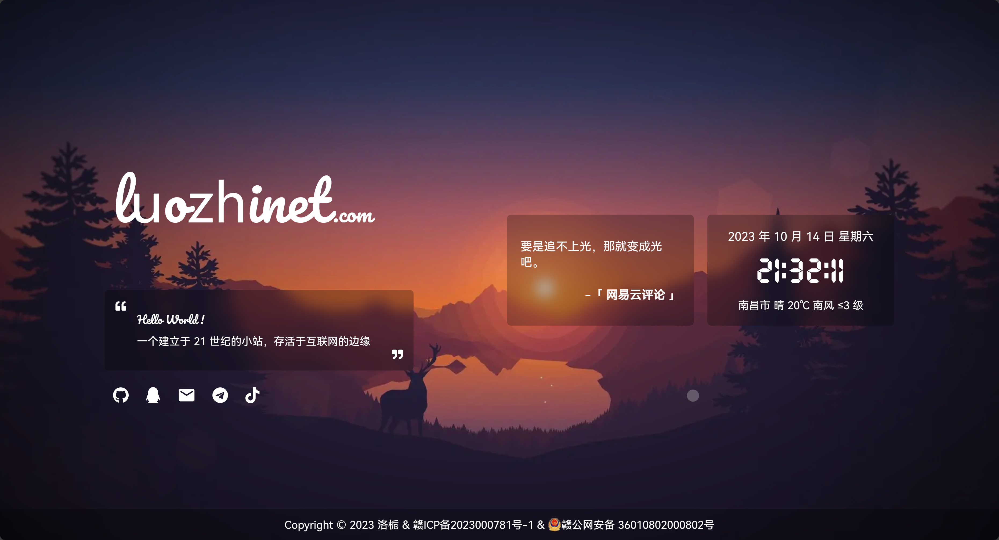

<p>
<strong><h2>洛栀の主页</h2></strong>
简单的小主页
</p>



>主页的 Logo 字体已经过压缩，若用本站 Logo 以外的字母会变回默认字体，这里是 [完整字体](https://file.4everland.app/font/Other/Pacifico-Regular.ttf)

### Demo

>由于 CDN 缓存原因，查看最新效果可能需要 `Ctrl` + `F5` 强制刷新浏览器缓存

- [洛栀の主页](https://luozhinet.com)

### 功能

- [x] 载入动画
- [x] 站点简介
- [x] Hitokoto 一言
- [x] 日期及时间
- [x] 实时天气
- [x] 时光进度条
- [x] 音乐播放器
- [x] 移动端适配

* [ ] 播放器取消使用 Aplayer

### 部署

```bash
yarn install
yarn dev
yarn build
```
> 构建完成后，可将 `dist` 文件夹下的文件上传至服务器，也可使用 `Vercel` 等托管平台一键导入并自动部署
### 天气

天气及地区获取现改用 `腾讯地图位置服务` 相关 API

- 前往 [腾讯位置服务控制台](https://lbs.qq.com/dev/console/application/mine) 创建一个应用，在应用管理中创建密钥，并将创建的 `Key` 填入 `.env` 中的 `VITE_WEATHER_KEY` 中
- 需要在密钥管理中勾选「IP定位」和「天气查询」服务权限

也可自行更换其他方式


### 音乐

>本项目采用了基于 `MetingJS` 的 `Aplayer` 音乐播放器，可实现快速自定义歌单  
>*仅支持 **中国大陆地区**

请在 `.env` 文件中更改歌曲相关参数即可实现自定义歌单列表

```bash
# 歌曲 API 地址
VITE_SONG_API = "https://api-meting.luozhinet.com"
# 歌曲服务器 ( netease-网易云, tencent-qq音乐 )
VITE_SONG_SERVER = "netease"
# 播放类型 ( song-歌曲, playlist-播放列表, album-专辑, search-搜索, artist-艺术家 )
VITE_SONG_TYPE = "playlist"
# 播放 ID
VITE_SONG_ID = "7452421335"
```

### 字体

现采用 `HarmonyOS Sans` 开源字体，采用字体拆分，提升加载速度


### 技术栈

* [Vue](https://cn.vuejs.org/)
* [Vite](https://vitejs.cn/vite3-cn/)
* [Pinia](https://pinia.vuejs.org/zh/)
* [IconPark](https://iconpark.oceanengine.com/official)
* [xicons](https://xicons.org/)
* [Aplayer](https://aplayer.js.org/)

### API

* [MetingAPI By 武恩赐](https://api.wuenci.com/meting/api/)
* [小歪 API](https://api.ixiaowai.cn/)
* [高德开放平台](https://lbs.amap.com/)
* [Hitokoto 一言](https://hitokoto.cn/)

<a title="SSL" target="_blank" href="https://myssl.com/seal/detail?domain=luozhinet.com"></a>&nbsp;<a title="CDN" target="_blank" href="https://cdnjs.com/"></a>&nbsp;<a title="Copyright" target="_blank" href="https://luozhinet.com/">
